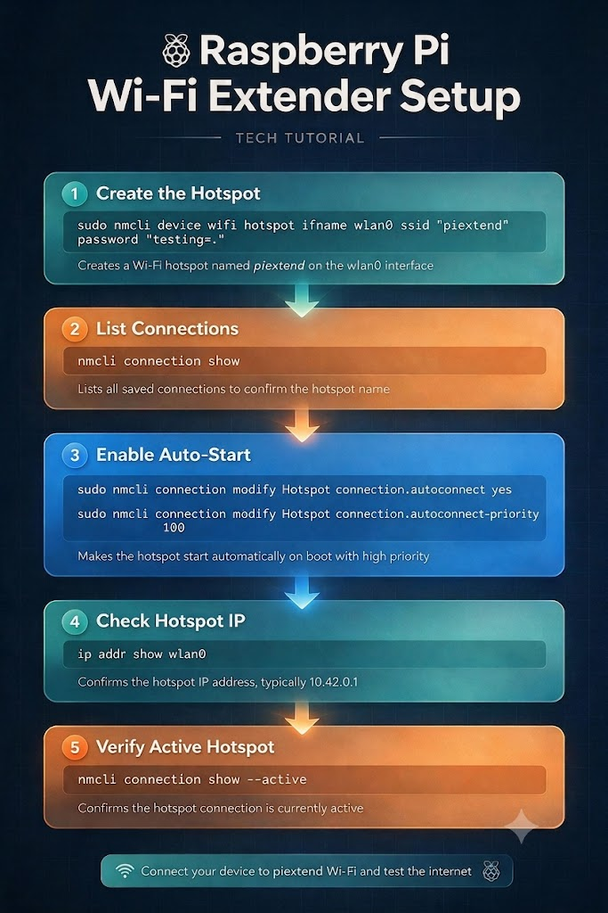

# WiFi-Extender using Raspberry Pi

Turn a Raspberry Pi into a Wi-Fi extender / hotspot using `nmcli` (NetworkManager).
The Pi stays connected upstream (Ethernet or a second adapter) and rebroadcasts a
new Wi-Fi network that other devices can join.

<p align="center">
  
</p>

## Requirements

- Raspberry Pi with a Wi-Fi interface (`wlan0`)
- Raspberry Pi OS Bookworm or newer (NetworkManager is the default there)
- An upstream internet connection (Ethernet recommended, or a second Wi-Fi adapter)

## Setup

### 1. Create the hotspot

Creates a Wi-Fi hotspot named `piextend` on the `wlan0` interface.

```bash
sudo nmcli device wifi hotspot ifname wlan0 ssid "piextend" password "testing=."
```

> Replace `testing=.` with your own password. It must be at least 8 characters.

### 2. List connections

Lists all saved connections so you can confirm the hotspot's connection name
(NetworkManager usually names it `Hotspot`).

```bash
nmcli connection show
```

### 3. Enable auto-start on boot

Makes the hotspot start automatically at boot, with a high priority so it wins
over other saved connections.

```bash
sudo nmcli connection modify Hotspot connection.autoconnect yes
```

```bash
sudo nmcli connection modify Hotspot connection.autoconnect-priority 100
```

### 4. Check the hotspot IP

Confirms the hotspot's IP address — typically `10.42.0.1`.

```bash
ip addr show wlan0
```

### 5. Verify the hotspot is active

```bash
nmcli connection show --active
```

## Test it

Connect a phone or laptop to the **piextend** Wi-Fi network using the password from
step 1, and check that you have internet access.

## Useful extras

Stop the hotspot:

```bash
sudo nmcli connection down Hotspot
```

Bring it back up:

```bash
sudo nmcli connection up Hotspot
```

Show the hotspot password:

```bash
sudo nmcli device wifi show-password
```

Delete the hotspot connection entirely:

```bash
sudo nmcli connection delete Hotspot
```

## Notes

- `wlan0` is the built-in Wi-Fi on most Pi models. Run `nmcli device` to confirm your
  interface name.
- A single Wi-Fi radio cannot reliably be a client and an access point at the same
  time. For a true extender, feed the Pi with Ethernet or add a USB Wi-Fi adapter for
  the upstream link.
- NetworkManager handles NAT and DHCP for hotspot clients automatically, which is why
  clients land on the `10.42.0.x` subnet.

## License

See [LICENSE](LICENSE).
